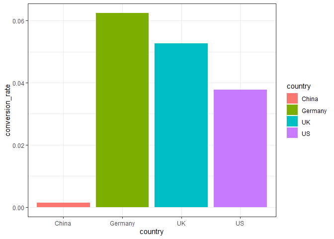
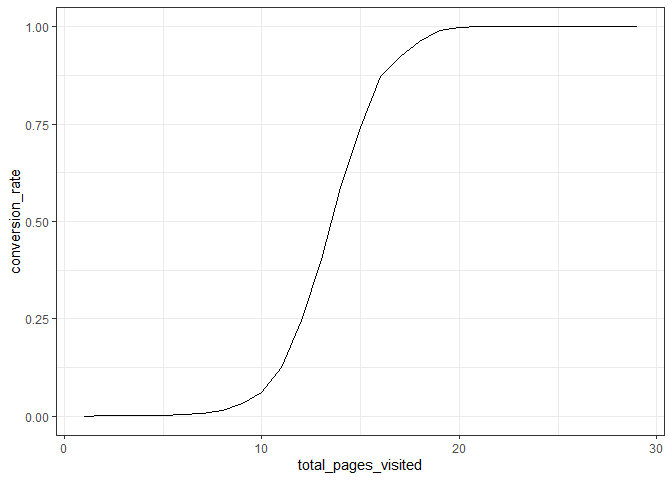
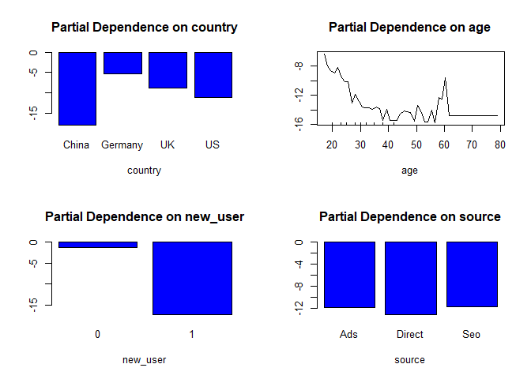
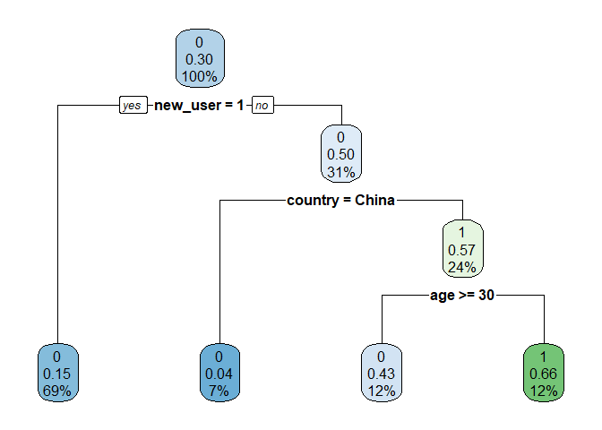

Conversion Data Analysis
================

# First Challenge: Analyzing Conversion Data

``` r
df=read.csv("https://drive.google.com/uc?export=download&id=1LU5be_H1TD2Pp1OmI202to3YyKo9AzFY", stringsAsFactors = TRUE)
```

## Descriptive Analysis

``` r
head(df)
```

    ##   country age new_user source total_pages_visited converted
    ## 1      UK  25        1    Ads                   1         0
    ## 2      US  23        1    Seo                   5         0
    ## 3      US  28        1    Seo                   4         0
    ## 4   China  39        1    Seo                   5         0
    ## 5      US  30        1    Seo                   6         0
    ## 6      US  31        0    Seo                   1         0

``` r
summary(df)
```

    ##     country            age            new_user         source      
    ##  China  : 76602   Min.   : 17.00   Min.   :0.0000   Ads   : 88740  
    ##  Germany: 13056   1st Qu.: 24.00   1st Qu.:0.0000   Direct: 72420  
    ##  UK     : 48450   Median : 30.00   Median :1.0000   Seo   :155040  
    ##  US     :178092   Mean   : 30.57   Mean   :0.6855                  
    ##                   3rd Qu.: 36.00   3rd Qu.:1.0000                  
    ##                   Max.   :123.00   Max.   :1.0000                  
    ##  total_pages_visited   converted      
    ##  Min.   : 1.000      Min.   :0.00000  
    ##  1st Qu.: 2.000      1st Qu.:0.00000  
    ##  Median : 4.000      Median :0.00000  
    ##  Mean   : 4.873      Mean   :0.03226  
    ##  3rd Qu.: 7.000      3rd Qu.:0.00000  
    ##  Max.   :29.000      Max.   :1.00000

Let us have a look at the oldest 10 users in the dataset.

``` r
age_id_10 <- order(df$age, decreasing = T)[1:10]
df[age_id_10, ]
```

    ##        country age new_user source total_pages_visited converted
    ## 90929  Germany 123        0    Seo                  15         1
    ## 295582      UK 111        0    Ads                  10         1
    ## 265168      US  79        1 Direct                   1         0
    ## 192645      US  77        0 Direct                   4         0
    ## 154218      US  73        1    Seo                   5         0
    ## 208970      US  72        1 Direct                   4         0
    ## 114486      US  70        1    Ads                   9         0
    ## 301367      UK  70        0    Ads                   5         0
    ## 57123       UK  69        1 Direct                   4         0
    ## 168375   China  69        1    Ads                   4         0

The first two rows of data seem unrealistic. If we are unable to check
the data source, we should probably remove these two rows as they are
either untrustworthy or are outliers.

``` r
df <- subset(df, age < 80)
```

## Visualizations

Let us see how conversion rate relates to the regressors. \#\#\#
Convertion rate and Country

``` r
require(ggplot2)
```

    ## Loading required package: ggplot2

``` r
require(dplyr)
```

    ## Loading required package: dplyr

    ## 
    ## Attaching package: 'dplyr'

    ## The following objects are masked from 'package:stats':
    ## 
    ##     filter, lag

    ## The following objects are masked from 'package:base':
    ## 
    ##     intersect, setdiff, setequal, union

``` r
data_country <- df %>%
  group_by(country)%>%
  summarise(conversion_rate = mean(converted))
```

    ## `summarise()` ungrouping output (override with `.groups` argument)

``` r
data_country %>% 
  ggplot(aes(x = country, y = conversion_rate))+
  geom_bar(stat = "identity", aes(fill = country))+
  theme_bw()
```

<!-- -->

The conversion rate from Chinese customers is a lot lower than other
countries.

### Conversion rate and total pages visited

Let us see how total pages visited relates to the conversion rate.

``` r
data_page_visit <- df %>%
  group_by(total_pages_visited)%>%
  summarise(conversion_rate = mean(converted))
```

    ## `summarise()` ungrouping output (override with `.groups` argument)

``` r
ggplot(data = data_page_visit, aes(x = total_pages_visited, y = conversion_rate))+
  geom_line()+
  theme_bw()
```

<!-- -->

Convert ‘converted’ and ‘new\_user’ into factors.

``` r
df$converted <- as.factor(df$converted)
df$new_user <- as.factor(df$new_user)
```

## Modelling

Splitting the dataset into training (0.7) and testing (0.3).

``` r
sample_id <- sample(nrow(df), size = 0.7*nrow(df))
trainset <- df[sample_id, ]
testset <- df[-sample_id, ]
```

Use logistic regression first (benchmark):

``` r
logit_model <- glm(converted ~., data = trainset, family = "binomial")
summary(logit_model)
```

    ## 
    ## Call:
    ## glm(formula = converted ~ ., family = "binomial", data = trainset)
    ## 
    ## Deviance Residuals: 
    ##     Min       1Q   Median       3Q      Max  
    ## -2.9870  -0.0625  -0.0239  -0.0096   4.4130  
    ## 
    ## Coefficients:
    ##                       Estimate Std. Error z value Pr(>|z|)    
    ## (Intercept)         -10.299921   0.178066 -57.843  < 2e-16 ***
    ## countryGermany        3.831408   0.156329  24.509  < 2e-16 ***
    ## countryUK             3.564359   0.141954  25.109  < 2e-16 ***
    ## countryUS             3.203338   0.137538  23.291  < 2e-16 ***
    ## age                  -0.075318   0.002851 -26.421  < 2e-16 ***
    ## new_user1            -1.729786   0.042515 -40.687  < 2e-16 ***
    ## sourceDirect         -0.162480   0.058123  -2.795  0.00518 ** 
    ## sourceSeo            -0.037161   0.047645  -0.780  0.43542    
    ## total_pages_visited   0.760681   0.007455 102.037  < 2e-16 ***
    ## ---
    ## Signif. codes:  0 '***' 0.001 '**' 0.01 '*' 0.05 '.' 0.1 ' ' 1
    ## 
    ## (Dispersion parameter for binomial family taken to be 1)
    ## 
    ##     Null deviance: 63214  on 221337  degrees of freedom
    ## Residual deviance: 17930  on 221329  degrees of freedom
    ## AIC: 17948
    ## 
    ## Number of Fisher Scoring iterations: 10

Most of the parameters are very significant. Let us see if the model
predicts well.

``` r
probs <- predict(logit_model, newdata = testset[, -6], type = "response")
head(probs)
```

    ##            3            7           13           18           24           26 
    ## 3.597566e-04 1.576436e-05 3.010691e-04 1.782883e-03 7.374703e-04 2.994022e-01

``` r
preds <- ifelse(probs > 0.5, 1,0)
```

``` r
require(caret)
```

    ## Loading required package: caret

    ## Loading required package: lattice

``` r
head(preds)
```

    ##  3  7 13 18 24 26 
    ##  0  0  0  0  0  0

``` r
confusionMatrix(as.factor(preds), as.factor(testset$converted))
```

    ## Confusion Matrix and Statistics
    ## 
    ##           Reference
    ## Prediction     0     1
    ##          0 91465   959
    ##          1   356  2080
    ##                                           
    ##                Accuracy : 0.9861          
    ##                  95% CI : (0.9854, 0.9869)
    ##     No Information Rate : 0.968           
    ##     P-Value [Acc > NIR] : < 2.2e-16       
    ##                                           
    ##                   Kappa : 0.7528          
    ##                                           
    ##  Mcnemar's Test P-Value : < 2.2e-16       
    ##                                           
    ##             Sensitivity : 0.9961          
    ##             Specificity : 0.6844          
    ##          Pos Pred Value : 0.9896          
    ##          Neg Pred Value : 0.8539          
    ##              Prevalence : 0.9680          
    ##          Detection Rate : 0.9642          
    ##    Detection Prevalence : 0.9743          
    ##       Balanced Accuracy : 0.8403          
    ##                                           
    ##        'Positive' Class : 0               
    ## 

By confusion matrix, we can see that although the overall accuracy rate
seems high, the specificity is not so good. We might want to change the
cutoff point id we care more about specificity rate.

Let us use random forest model to see if it can catch more insights.

``` r
require(randomForest)
```

    ## Loading required package: randomForest

    ## randomForest 4.6-14

    ## Type rfNews() to see new features/changes/bug fixes.

    ## 
    ## Attaching package: 'randomForest'

    ## The following object is masked from 'package:dplyr':
    ## 
    ##     combine

    ## The following object is masked from 'package:ggplot2':
    ## 
    ##     margin

``` r
set.seed(1)
model_rf <- randomForest(y = trainset$converted, x = trainset[, -6], ytest = testset$converted, xtest = testset[, -6], ntree = 100, mtry = 3, keep.forest = T)

model_rf
```

    ## 
    ## Call:
    ##  randomForest(x = trainset[, -6], y = trainset$converted, xtest = testset[,      -6], ytest = testset$converted, ntree = 100, mtry = 3, keep.forest = T) 
    ##                Type of random forest: classification
    ##                      Number of trees: 100
    ## No. of variables tried at each split: 3
    ## 
    ##         OOB estimate of  error rate: 1.46%
    ## Confusion matrix:
    ##        0    1 class.error
    ## 0 213268  911 0.004253452
    ## 1   2317 4842 0.323648554
    ##                 Test set error rate: 1.44%
    ## Confusion matrix:
    ##       0    1 class.error
    ## 0 91449  372 0.004051361
    ## 1   992 2047 0.326423166

As the training error and testing error are very close, there should not
be overfitting problem. Also, the false positive rate is much higher
using random forest model than using logistic regression, but the false
negative rate is lower.

Let us look at variable importance of the regressors.

``` r
importance(model_rf)
```

    ##                     MeanDecreaseGini
    ## country                     527.9259
    ## age                         747.0113
    ## new_user                    412.7389
    ## source                      205.3857
    ## total_pages_visited        8135.0168

According to Gini index, total\_pages\_visited is the most important
variable in predicting conversion rate. However, this is not very
meaningful as people often visit a lot more pages as they already have a
high incentive to buy.

Let us try fit the model without total\_pages\_visited.

``` r
model_rf1 <- randomForest(y = trainset$converted, x = trainset[, -c(5, 6)], ytest = testset$converted, xtest = testset[, -c(5, 6)], ntree = 100, mtry = 3, keep.forest = T)

model_rf1
```

    ## 
    ## Call:
    ##  randomForest(x = trainset[, -c(5, 6)], y = trainset$converted,      xtest = testset[, -c(5, 6)], ytest = testset$converted, ntree = 100,      mtry = 3, keep.forest = T) 
    ##                Type of random forest: classification
    ##                      Number of trees: 100
    ## No. of variables tried at each split: 3
    ## 
    ##         OOB estimate of  error rate: 3.23%
    ## Confusion matrix:
    ##        0 1 class.error
    ## 0 214179 0           0
    ## 1   7159 0           1
    ##                 Test set error rate: 3.2%
    ## Confusion matrix:
    ##       0 1 class.error
    ## 0 91821 0           0
    ## 1  3039 0           1

This is not so good. The new model does not predict any ones, probably
because the data is imbalanced. Let’s change the data weights and rerun
the model.

``` r
model_rf2 <- randomForest(y = trainset$converted, x = trainset[, -c(5, 6)], ytest = testset$converted, xtest = testset[, -c(5, 6)], ntree = 100, mtry = 3, keep.forest = T, classwt = c(0.7,0.3))

model_rf2
```

    ## 
    ## Call:
    ##  randomForest(x = trainset[, -c(5, 6)], y = trainset$converted,      xtest = testset[, -c(5, 6)], ytest = testset$converted, ntree = 100,      mtry = 3, classwt = c(0.7, 0.3), keep.forest = T) 
    ##                Type of random forest: classification
    ##                      Number of trees: 100
    ## No. of variables tried at each split: 3
    ## 
    ##         OOB estimate of  error rate: 14.09%
    ## Confusion matrix:
    ##        0     1 class.error
    ## 0 186231 27948   0.1304890
    ## 1   3245  3914   0.4532756
    ##                 Test set error rate: 14.03%
    ## Confusion matrix:
    ##       0     1 class.error
    ## 0 79902 11919   0.1298069
    ## 1  1388  1651   0.4567292

Check the variable importance again.

``` r
importance(model_rf2)
```

    ##          MeanDecreaseGini
    ## country         8225.1087
    ## age             5508.3986
    ## new_user       12765.1297
    ## source           591.6458

New user is most important factor now. Source is not important at all.

Let us check partial dependence plots of the regressors.

``` r
par(mfrow = c(2,2))
partialPlot(model_rf2, trainset, country, 1)
partialPlot(model_rf2, trainset, age, 1)
partialPlot(model_rf2, trainset, new_user, 1)
partialPlot(model_rf2, trainset, source, 1)
```

<!-- -->

Just like what we see from descriptive plots, Chinese users have low
conversion rates compared to users from other countries. Also, new users
are a lot less likely to convert compared to old users. Young users
(around 20 years old) are most likely to convert. Conversion rate drops
with users age go up but there is also a spike in conversion rate for
users around 60 years old.

We can also check a few decision trees.

``` r
require(rpart)
```

    ## Loading required package: rpart

``` r
model_tree <- rpart(df$converted ~., df[, -c(5,6)], method = "class", control = rpart.control(maxdepth = 3), parms = list(prior = c(0.7, 0.3)))
rpart.plot::rpart.plot(model_tree)
```

    ## Warning: Bad 'data' field in model 'call' (expected a data.frame or a matrix).
    ## To silence this warning:
    ##     Call rpart.plot with roundint=FALSE,
    ##     or rebuild the rpart model with model=TRUE.

<!-- -->

## Conclusion

1.  Explore the Germany market. The user base is not big in Germany but
    the conversion rate is very high. If some marketing can attract more
    Germany users, it is likely to see a big boost in sales.
2.  Young users have very high conversion rate compared to people \> 30
    years old. Maybe because the company only has products that young
    people like. If we can have a product targeted for older people, we
    might see s increase in sales from them.
3.  Old accounts are very important. Send targeted emails to old
    accounts to bring them back to the site, even try send targeted
    coupons if the company is eager to see an increase in sales.
4.  Try to find why conversion rate from China is so low. Is there a
    translation issue? Does the low conversion rate happen recently? Is
    it possible that payment method needs modified in China?
